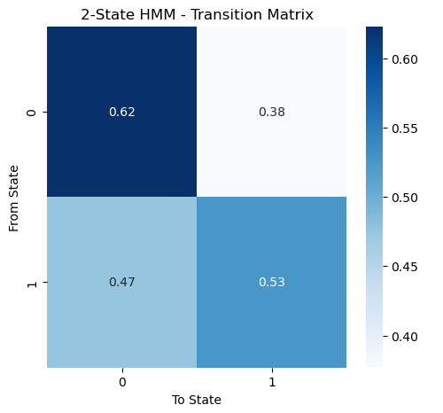
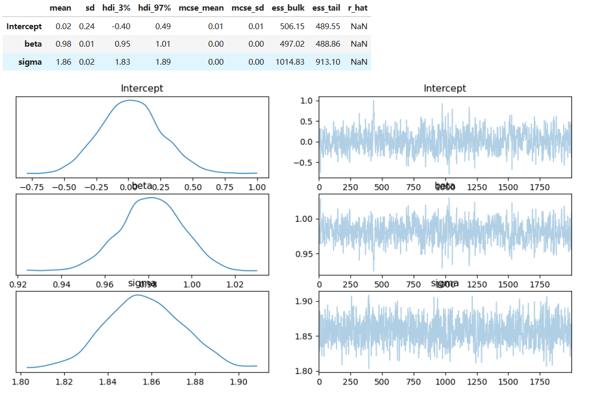

# Bayesian Machine Learning with Generative AI Applications
## Predicting Box Office Success: A Bayesian Approach Using Movie Metadata
Win 25 | The Matrix Masters 🏆

Authors: Ritai Na, Dazhou Wu, Yidi Wang, Lucia Liu, Yiyang Yao

## **Abstract**
This project explores predicting box office success using a Bayesian approach with movie metadata. 
By integrating Bayesian Networks, Hierarchical Bayesian Regression, Hidden Markov Models, and MCMC sampling, we develop a robust probabilistic framework for revenue forecasting.
Our methodology provides credible intervals for revenue estimates, assisting investors and studios in optimizing financial decision-making.

## Table of Contents
- [Overview](#Overview)
- [Data Processing and EDA](#Data-Processing-and-EDA)
- [Bayesian Network](#Bayesian-Network)
- [Hidden Markov Model](#Hidden-Markov-Model)
- [Hierarchical Bayesian Model with HMM](#Hierarchical-bayesian-model-with-HMM)
- [MCMC Sampling](#MCMC-Sampling)
- [Future Work](#future-work)

## **Overview**
This project explores the application of **Hidden Markov Models (HMM)** and **Hierarchical Bayesian Modeling (HBM)** in analyzing trends in the movie industry. By leveraging machine learning and probabilistic modeling, we extract latent patterns from historical movie data.

## **Data Processing and EDA**

## **Bayesian Network**
This project leverages a Bayesian Network to predict a movie’s box office success using probabilistic modeling. We apply Bayesian Inference to analyze the impact of key production factors like budget, opening weekend revenue, theater count, genre, and MPAA rating on box office performance.

- Bayesian Networks for causal relationships
- Conditional Probability Distributions (CPDs) for likelihood estimation
- Variable Elimination for probabilistic queries
- Graphical visualization of dependencies

### Bayesian Inference Results
What is the probability of success given a high budget and large theater release?

| BoxOfficeSuccess  | Probability  |
|------------------|-------------|
| Flop            | 18.77%       |
| Hit             | 81.23%       |

* Interpretation: Movies with high budgets and large releases have an 81.23% probability of success.

## **Hierarchical Bayesian Modeling (HBM)**


## Hidden Markov Model 

This model outlines the use of a Gaussian Hidden Markov Model (HMM) to capture latent market dynamics in movie box office data. The HMM model should be helpful combing with the Hierarchical Bayesian Model. 

### 1. HMM Model Definition
A **Hidden Markov Model (HMM)** is a statistical model for time series data where the system is assumed to be a Markov process with unobserved (hidden) states. 
In our application:
- **Hidden States** represent the underlying market conditions (e.g., "high revenue" vs. "low revenue" periods) that are not directly observed.
- **Emission Probabilities** assume that the observed data (e.g., log-transformed box office numbers) are generated from a probability distribution (in our case, a Gaussian) specific to each hidden state.
- **Transition Matrix** describes the probabilities of transitioning from one hidden state to another between successive movies (or time periods). This matrix is key in understanding the dynamics of market state changes.


### 2. Feature Engineering for HMM
Effective feature engineering is crucial for accurately capturing the latent dynamics in movie box office data. Our approach involves processing various types of features, but it is important to note that for the HMM model, we only use numerical variables since there may be
- **Temporal Ordering**: Numerical variables such as log-transformed production budget, domestic gross, worldwide gross, opening weekend, max theaters, and weeks run naturally have a time order when arranged sequentially by movie release timing. This temporal ordering is essential for HMMs to capture market dynamics.
```python
log_transform_cols = [
    'Production Budget (USD)', 'Domestic Gross (USD)', 'Worldwide Gross (USD)','Opening Weekend (USD)', 'Max Theaters', 'Weeks Run'
]
```
```python
df_sorted = df.sort_values(by=['Release_Year', 'Release_Month', 'Release_DayOfWeek'])
```

- **Model Compatibility**: Gaussian HMMs assume that observations are continuous and approximately normally distributed within each hidden state. 
- **Avoiding High-Dimensional Noise**: Textual data requires additional NLP processing to convert them into numerical form. However, text data typically lack inherent sequential order that reflects market dynamics.

### 3. Model Building
```python
X = df_features.values

scaler = StandardScaler()
X_scaled = scaler.fit_transform(X)

model_2_states = GaussianHMM(n_components=2, covariance_type="full", n_iter=1000, random_state=42)
model_2_states.fit(X_scaled)
```


### 4. Model Result


This matrix tells us that if the market is in state 0 (e.g., a high revenue state), there is a 62.3% chance that it will remain in state 0 and a 37.7% chance of switching to state 1 (e.g., a lower revenue state) in the next period.


## **Hierarchical Bayesian Model with HMM**

## Usage
1. **Load and preprocess data** using `pandas`.
2. **Train the HMM model** and analyze state transitions.
3. **(Upcoming) Implement Bayesian modeling** for deeper analysis.
4. **Interpret movie success patterns** and gain industry insights.


  
## MCMC sampling

### MCMC Benifits
MCMC methods provide several significant advantages in the context of predicting movie box office revenues:
#### Handling of Uncertainty:
MCMC naturally incorporates uncertainty in the estimates, providing a full probability distribution for each model parameter. This is particularly useful in scenarios like movie revenue predictions where inherent unpredictability is high due to factors like audience preferences and competitor actions.

#### Complex Models:
MCMC enables the estimation of more complex models that are not easily solvable with traditional methods due to the integration of prior beliefs and the likelihood from the data. This is useful in adjusting for overfitting and underfitting, making the model more robust to new or unseen data.

#### Flexibility in Model Specification:
With MCMC, it's easier to specify and fit models that include non-linear relationships, interaction effects, and hierarchical structures—common scenarios in economic data like movie budgets and box office returns.

#### Integration of Prior Knowledge:
Prior distributions can be used effectively in MCMC to integrate previous research or expert opinions, which is especially beneficial when historical data on certain types of films (e.g., genres or new directors) might be sparse or non-indicative of future performance.

### MCMC Formula
The basic formula for the Metropolis-Hastings algorithm, which is commonly used in MCMC simulations, can be described as follows:
#### Initialization:
Start with an initial parameter value $\theta^{(0)}$
#### Iteration:
For each step $t$, generate a candidate parameter $\theta^\*$ from a proposal distribution $q(\theta^*|\theta^{(t-1)}).$   
#### Acceptance Probability:
$$\alpha=\min\left(1,\frac{p(\theta^\*|Y)\cdot q(\theta^{(t-1)}|\theta^\*)}{p(\theta^{(t-1)}|Y)\cdot q(\theta^*|\theta^{(t-1)})}\right)$$
Here, $p(\theta|Y)$  is the posterior distribution, and 𝑞 is the proposal distribution.
#### Decision:
Draw 𝑢 from a uniform distribution U(0,1). If $u\leq\alpha$, accept $\theta^{*}$ as $\theta^{(t)}$; otherwise, set $\theta^{(t)}=\theta^{(t-1)}$
#### Repeat:
Continue the iteration until convergence.
### Implementation in Movie Box-Office Prediction Analysis
In our movie box office prediction model, the PyMC3 library facilitated the implementation of Bayesian linear regression with MCMC. We modeled the logarithm of the domestic box office revenue as a linear function of the logarithm of the production budget. Here's the detailed implementation:

### Results & Visualization


The model fitting with MCMC sampling produced reliable estimates:

***Intercept:*** Mean = 0.02, SD = 0.24

***Beta (slope):*** Mean = 0.98, SD = 0.01

***Sigma (error):*** Mean = 1.86, SD = 0.02

Trace plots from the MCMC sampling confirmed good mixing and convergence, indicating the robustness of our model in capturing the relationship between production budgets and box office returns. The posterior distributions are indicative of the variability and uncertainty inherent in movie revenue predictions, allowing for better-informed decision-making in production investment strategies.

The following visualizations illustrate the effectiveness of our models:
1. **Hidden States Over Time**: A time series showing how movie states transition.
2. **State Feature Distributions**: Comparing movie attributes across hidden states.
3. **Predicted vs Actual Movie Performance**: Evaluating HMM’s predictive power.

_(To be included: Graphs and illustrations to enhance understanding.)_

## Future Work
Our current model is capable of handling manual variable inputs for predicting movie box office revenue. However, there are several promising directions for future work that can enhance its usability and performance:

1. **Generating new data from LLM to forecast its box office revenue**
w
   We can integrate generative AI (GenAI) techniques to automatically generate new hypothetical variables. Through our model, these new datas can serve as a interactive forecasting tool, enabling stakeholders to explore various market or production scenarios and assess their potential impact on box office performance.

2. **Developing a Web Interface or UI for Easier Prediction**  
   We plan to build a user-friendly webpage or UI that allows users to input data easily and obtain predictions from our current model, mkaing it easy to use. 

3. **Expanded Feature Set and Scenario Exploration**  
   Additional features—such as seasonal indicators, economic indicators, or social media sentiment—could be integrated into the model to capture further nuances in movie performance. This exploration could lead to a richer understanding of factors affecting box office revenue.


