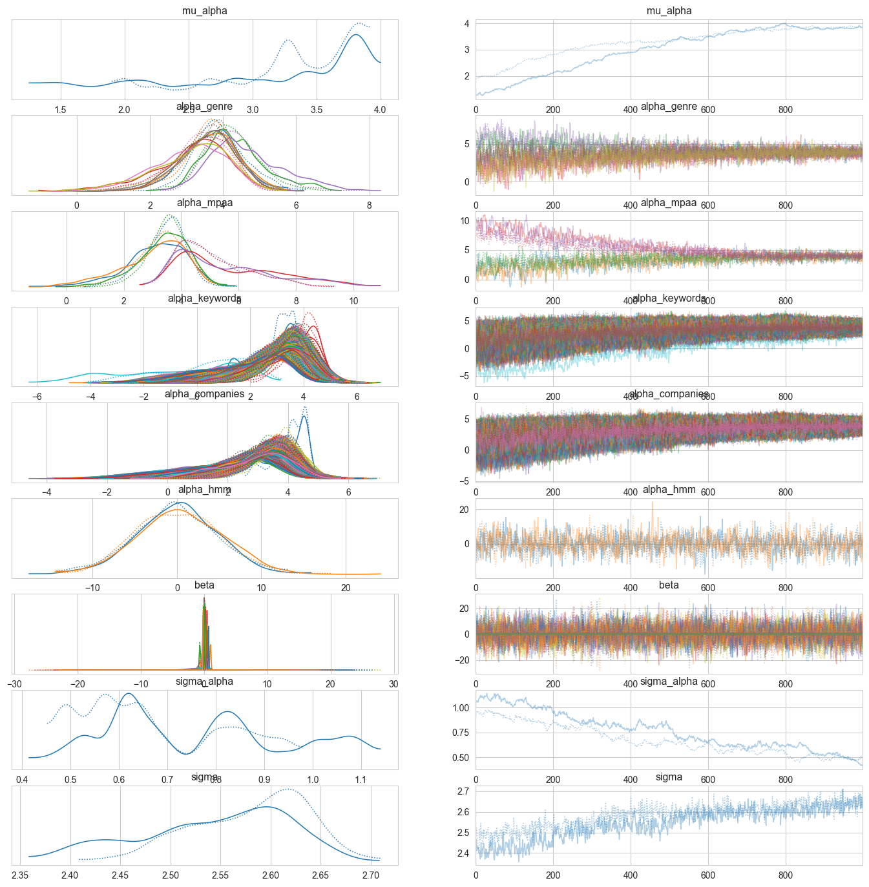

# Bayesian Machine Learning with Generative AI Applications
## Predicting Box Office Success: A Bayesian Approach Using Movie Metadata
Win 25 | The Matrix Masters 🏆

Authors: Ritai Na, Dazhou Wu, Yidi Wang, Lucia Liu, Yiyang Yao

***
## Table of Contents
- [Project Overview](#Project-Overview)
- [Data Processing and EDA](#Data-Processing-and-EDA)
- [Bayesian Network](#Bayesian-Network)
- [Hierarchical Bayesian Model](#Hierarchical-bayesian-model)
- [Hidden Markov Model](#Hidden-Markov-Model)
- [MCMC Sampling](#MCMC-Sampling)
- [Final Results and Visualization](#Final-Results-and-Visualization)
- [Future Work](#future-work)

***
## **Project Overview**

This project explores predicting box office success using a Bayesian approach with movie metadata. 
By integrating Bayesian Networks, Hierarchical Bayesian Regression, Hidden Markov Models, and MCMC sampling, we develop a robust model for revenue forecasting.
Our methodology provides credible intervals for revenue estimates, assisting investors and studios in optimizing financial decision-making.

- **Bayesian Networks:** To capture causal relationships among key production factors—such as budget, release scale, genre, and rating—thereby uncovering the underlying mechanisms that drive box office success.
- **Hierarchical Bayesian Regression:** To model both overall trends and group-specific variations, enabling refined predictions that account for differences across genres, markets, and other categorical influences.
- **Hidden Markov Models (HMM):** To identify and quantify latent market dynamics, revealing how underlying states (e.g., high versus low revenue periods) influence the evolution of box office performance over time.
- **MCMC Sampling:** To efficiently estimate the full posterior distributions of model parameters, providing robust uncertainty quantification and credible intervals for revenue forecasts.

**Rigorous data cleaning, feature engineering, and exploratory analysis ensure that our input data is both accurate and informative.** The result is a multi-layered, probabilistic model that not only predicts revenue with enhanced precision but also delivers actionable insights for investors and studios navigating a complex and volatile market environment.

***
## **Data Processing and EDA**

Our data processing pipeline ensures that our movie metadata is clean, informative, and ready for Bayesian modeling. Key steps include:

**Data Cleaning & Feature Engineering:**  
We removed unwanted columns—such as pure identifiers (e.g., `id`, `Movie URL`) and redundant fields—and eliminated duplicate MPAA dummy columns. Date columns were converted to datetime objects, and temporal features (Release_Year, Release_Month, Release_DayOfWeek) were extracted. Financial data inconsistencies were corrected by adjusting domestic and worldwide revenue values, calculating key ratios (Budget_to_WorldGross_Ratio and Domestic_vs_International_Ratio), and applying log transformations to reduce skewness (e.g., `Production Budget (USD)_log`). Additionally, categorical fields like MPAA Rating, Source, Genre, and Creative Type were standardized by trimming spaces, converting to title case, and merging similar categories for consistency.

**Entropy-Based Feature Selection:**  
We computed metadata for each feature—including missing value rates, number of unique values, entropy, and coefficient of variation—and filtered out features with more than 50% missing values, entropy below 30%, or (for numerical features) a coefficient of variation less than 0.2. This automated process allowed us to retain only the most informative features.

***
**EDA Visualizations:**  
To understand data distributions and identify potential multicollinearity, we generated key visualizations such as histograms (e.g., for the log-transformed production budget) and correlation heatmaps.

With these steps, our dataset is robust and ready for the next phases: Bayesian Network Construction for causal inference, Hierarchical Bayesian Regression with MCMC Sampling for revenue prediction and uncertainty quantification, and Hidden Markov Model Analysis to capture market dynamics.

With these steps, our dataset is robust and ready for:
- **Bayesian Network Construction** (causal inference),
- **Hierarchical Bayesian Regression with MCMC Sampling** (predicting box office revenue with uncertainty)
- **Hidden Markov Model Analysis** (capturing market dynamics).


***
## **Bayesian Network**
This project leverages a Bayesian Network to predict a movie’s box office success using probabilistic modeling. We apply Bayesian Inference to analyze the impact of key production factors like budget, opening weekend revenue, theater count, genre, and MPAA rating on box office performance.

- Bayesian Networks for causal relationships
- Conditional Probability Distributions (CPDs) for likelihood estimation
- Variable Elimination for probabilistic queries
- Graphical visualization of dependencies


In the Bayesian Network Structure, Nodes represent variables in the model, such as Production Budget, Opening Weekend, Genre, MPAA Rating, Max Theaters, Weeks Run, and BoxOfficeSuccess. For example, “Production Budget (USD)" → "Opening Weekend (USD)" suggest that higher budgets impact opening weekend revenue; and "Opening Weekend (USD)" → "BoxOfficeSuccess" indicates that a strong opening weekend is a predictor of overall success.

### Bayesian Inference Results
What is the probability of success given a high budget and large theater release?

| BoxOfficeSuccess  | Probability  |
|------------------|-------------|
| Flop            | 18.77%       |
| Hit             | 81.23%       |

* Interpretation: Movies with high budgets and large releases have an 81.23% probability of success.

***
## **Hierarchical Bayesian Model**
### 1. Definition
A **hierarchical model** (also known as a multi-level model) is used when data is grouped into categories, and observations within groups share similarities. These models account for variations both within and between groups.

### **Bayesian Framework**
In the Bayesian approach, model parameters are treated as random variables, and we update our beliefs about them using observed data. The model combines:

**Prior**: Our initial belief about the parameters.
**Likelihood**: The probability of the data given the parameters.
**Posterior**: The updated belief about the parameters after observing the data.

### **Bayesian Hierarchical Regression**
In a **Bayesian Hierarchical Regression**, we predict a target variable (e.g., revenue) based on predictors (e.g., budget, genre) while accounting for group-level effects like genre or country. This improves predictions, especially when data is sparse.

### **Implementation with PyMC**
The model is implemented using **PyMC**, a library that allows for flexible specification of priors, likelihoods, and model equations, and provides tools for sampling (e.g., MCMC).

### 2. Feature Engineering 
**Categorical Variable Encoding**
Used **Label Encoding** for categorical features

**Numerical Variable Standardization**
Applied **StandardScaler** to numerical features

**Target Variable**
Target: **Worldwide Gross (USD)_log**

**Group Indices for Hierarchical Model**
Method: Created group indices to account for group-level effects in the hierarchical model.

### Modelling
**Model Training**
**Priors:**
    - **alpha**: Normal prior with mean 0 and standard deviation 10.
    - **betas**: Normal priors for the regression coefficients with mean 0 and standard deviation 1.
    - **genre_effects, mpaa_effects, country_effects**: Normal priors for the hierarchical effects associated with genre, MPAA rating, and country, respectively.
    - **Model Equation**: The model combines the fixed effects (betas) and the hierarchical effects (genre_effects, mpaa_effects, country_effects) to model the target variable (y_obs).

**Likelihood:**
  The target variable (y_obs) is modeled as a normal distribution with a mean (mu) and a standard deviation (sigma).

**Sampling**
The model was fit using **MCMC sampling** with **pm.sample()**.
    The sampling configuration:
        - 2000 total draws
        - 1000 tuning steps
        - 4 chains using 4 core[model_summary.csv](https://github.com/user-attachments/files/19220118/model_summary.csv)

**Result**


[Uploading model_summary.csv…]()

- **Production Budget** (with a mean of 0.814) suggests that it has a strong positive effect on the **target variable**.
- The model suggests that the predictor variables have a statistically significant impact on the target variable, with most coefficients being positive. The model fits the data well, as indicated by the stable sigma and the good convergence diagnostics (R-hat values near 1).

***
## Hidden Markov Model 

This model outlines the use of a Gaussian Hidden Markov Model (HMM) to capture latent market dynamics in movie box office data. The HMM model should be helpful combing with the Hierarchical Bayesian Model. 

### 1. HMM Model Definition
A **Hidden Markov Model (HMM)** is a statistical model for time series data where the system is assumed to be a Markov process with unobserved (hidden) states. 
In our application:
- **Hidden States** represent the underlying market conditions (e.g., "high revenue" vs. "low revenue" periods) that are not directly observed.
- **Emission Probabilities** assume that the observed data (e.g., log-transformed box office numbers) are generated from a probability distribution (in our case, a Gaussian) specific to each hidden state.
- **Transition Matrix** describes the probabilities of transitioning from one hidden state to another between successive movies (or time periods). This matrix is key in understanding the dynamics of market state changes.


### 2. Feature Engineering for HMM
Effective feature engineering is crucial for accurately capturing the latent dynamics in movie box office data. Our approach involves processing various types of features, but it is important to note that for the HMM model, we only use numerical variables since there may be
- **Temporal Ordering**: Numerical variables such as log-transformed production budget, domestic gross, worldwide gross, opening weekend, max theaters, and weeks run naturally have a time order when arranged sequentially by movie release timing. This temporal ordering is essential for HMMs to capture market dynamics.
```python
log_transform_cols = [
    'Production Budget (USD)', 'Domestic Gross (USD)', 'Worldwide Gross (USD)','Opening Weekend (USD)', 'Max Theaters', 'Weeks Run'
]
```
```python
df_sorted = df.sort_values(by=['Release_Year', 'Release_Month', 'Release_DayOfWeek'])
```

- **Model Compatibility**: Gaussian HMMs assume that observations are continuous and approximately normally distributed within each hidden state.


- **Avoiding High-Dimensional Noise**: Textual data requires additional NLP processing to convert them into numerical form. However, text data typically lack inherent sequential order that reflects market dynamics.

### 3. Model Building
```python
X = df_features.values

scaler = StandardScaler()
X_scaled = scaler.fit_transform(X)

model_2_states = GaussianHMM(n_components=2, covariance_type="full", n_iter=1000, random_state=42)
model_2_states.fit(X_scaled)
```


### 4. Model Result


This matrix tells us that if the market is in state 0 (e.g., a high revenue state), there is a 62.3% chance that it will remain in state 0 and a 37.7% chance of switching to state 1 (e.g., a lower revenue state) in the next period.

***
## MCMC sampling

### MCMC Benifits
MCMC methods provide several significant advantages in the context of predicting movie box office revenues:
#### Handling of Uncertainty:
MCMC naturally incorporates uncertainty in the estimates, providing a full probability distribution for each model parameter. This is particularly useful in scenarios like movie revenue predictions where inherent unpredictability is high due to factors like audience preferences and competitor actions.

### Complex Models:
MCMC enables the estimation of more complex models that are not easily solvable with traditional methods due to the integration of prior beliefs and the likelihood from the data. This is useful in adjusting for overfitting and underfitting, making the model more robust to new or unseen data.

### Flexibility in Model Specification:
With MCMC, it's easier to specify and fit models that include non-linear relationships, interaction effects, and hierarchical structures—common scenarios in economic data like movie budgets and box office returns.

### Integration of Prior Knowledge:
Prior distributions can be used effectively in MCMC to integrate previous research or expert opinions, which is especially beneficial when historical data on certain types of films (e.g., genres or new directors) might be sparse or non-indicative of future performance.

### MCMC Formula
The basic formula for the Metropolis-Hastings algorithm, which is commonly used in MCMC simulations, can be described as follows:
### Initialization:
Start with an initial parameter value $\theta^{(0)}$
### Iteration:
For each step $t$, generate a candidate parameter $\theta^\*$ from a proposal distribution $q(\theta^*|\theta^{(t-1)}).$   
### Acceptance Probability:
$$\alpha=\min\left(1,\frac{p(\theta^\*|Y)\cdot q(\theta^{(t-1)}|\theta^\*)}{p(\theta^{(t-1)}|Y)\cdot q(\theta^*|\theta^{(t-1)})}\right)$$
Here, $p(\theta|Y)$  is the posterior distribution, and 𝑞 is the proposal distribution.
### Decision:
Draw 𝑢 from a uniform distribution U(0,1). If $u\leq\alpha$, accept $\theta^{*}$ as $\theta^{(t)}$; otherwise, set $\theta^{(t)}=\theta^{(t-1)}$
### Repeat:
Continue the iteration until convergence.
### Implementation in Movie Box-Office Prediction Analysis
In our movie box office prediction model, the PyMC3 library facilitated the implementation of Bayesian linear regression with MCMC. We modeled the logarithm of the domestic box office revenue as a linear function of the logarithm of the production budget. Here's the detailed implementation:

### Examples


The model fitting with MCMC sampling produced reliable estimates:

***Intercept:*** Mean = 0.02, SD = 0.24

***Beta (slope):*** Mean = 0.98, SD = 0.01

***Sigma (error):*** Mean = 1.86, SD = 0.02

Trace plots from the MCMC sampling confirmed good mixing and convergence, indicating the robustness of our model in capturing the relationship between production budgets and box office returns. The posterior distributions are indicative of the variability and uncertainty inherent in movie revenue predictions, allowing for better-informed decision-making in production investment strategies.

***
### Final Results and Visualization
After training our final hierarchical Bayesian model-incorporating global intercepts, group-level effects (e.g., Genre, MPAA, Keywords, Companies, HMM state), and fixed effects (e.g., numeric variables)，we examined the posterior distributions and parameter traceplots to assess both convergence and interpretability.



#### Key Obeservation:
1. **Global Intercept (`mu_alpha`)**  
- The posterior distribution for `mu_alpha` centers around a moderate positive value, indicating the model’s overall baseline for log-transformed revenue before considering group-level or fixed effects.  
- Its MCMC trace is stable and well-mixed, suggesting good convergence.

2. **Group-Level Effects (`genre`, `mpaa`, `keywords`, `companies`, `hmm`)**  
- Each group-level parameter has its own posterior distribution, typically centered near zero.  
- **Genre and MPAA**: Some categories deviate slightly above or below zero, implying these groups nudge revenue predictions up or down in log space.  
- **Keywords and Companies**: Most remain close to zero, suggesting modest but varied effects across different keywords or production entities.  
- **HMM State (`alpha_hmm`)**: Reflects how the hidden market state (derived from our Gaussian HMM) shifts predicted revenue. If its mean is uniquely positive or negative, it indicates a notable impact from latent market conditions.

3. **Fixed Effects Coefficients (`beta`)**  
- The posterior distribution of `beta` for numeric variables (e.g., production budget, opening weekend) reveals their average contribution to the log revenue.  
- If some `beta` values center away from zero with tight credible intervals, those features have a strong predictive effect.

4. **Group Variance (`sigma_alpha`)**  
- This parameter measures variability across categories within each group (e.g., different genres). A larger value implies more diverse effects; a smaller one suggests the categories behave similarly.  
- The traceplot for `sigma_alpha` is stable, indicating the model is confident about how different each category can be from the global mean.

5. **Residual Error (`sigma`)**  
- The posterior for `sigma` represents the unexplained variance on the log scale. A higher value indicates the model cannot fully account for revenue fluctuations, while a lower value means it explains more variance.  
- In real-world box office data, many unobserved factors (e.g., marketing, cultural events) can cause high residual variability.

***
#### Prediction Model


1. Strong Positive Correlation
- The points generally follow a diagonal trend, indicating that as the actual worldwide gross increases, the model’s predicted values also increase.
2. High Accuracy in Mid-Range Revenue
- For moderate actual values (roughly between 6.0 and 15.0 on the log scale), the points are relatively close to the red dashed line. This suggests that the model predicts reasonably well for mid-range grosses.
3. Greater Dispersion for Extreme Revenues
- At very high actual values (beyond ~18–20 on the log scale), the data points begin to spread more。

### Overall Good Fit!

***
## Future Work
Our current model is capable of handling manual variable inputs for predicting movie box office revenue. However, there are several directions for future work that can enhance its usability and performance:

1. **More Computational Power is needed!**
- Training the model using MCMC sampling is computationally intensive—often taking up to 8 hours or more. This long training time is primarily due to the inherent complexity of MCMC sampling in high-dimensional parameter spaces.
   
2. **Generating new data from LLM to forecast its box office revenue**
- We can integrate generative AI (GenAI) techniques to automatically generate new hypothetical variables. Through our model, these new datas can serve as a interactive forecasting tool, enabling stakeholders to explore various market or production scenarios and assess their potential impact on box office performance.

5. **Developing a Web Interface or UI for Easier Prediction**  
- We plan to build a user-friendly webpage or UI that allows users to input data easily and obtain predictions from our current model, mkaing it easy to use. 

6. **Expanded Feature Set and Scenario Exploration**  
- Additional features—such as seasonal indicators, economic indicators, or social media sentiment—could be integrated into the model to capture further nuances in movie performance. This exploration could lead to a richer understanding of factors affecting box office revenue.


